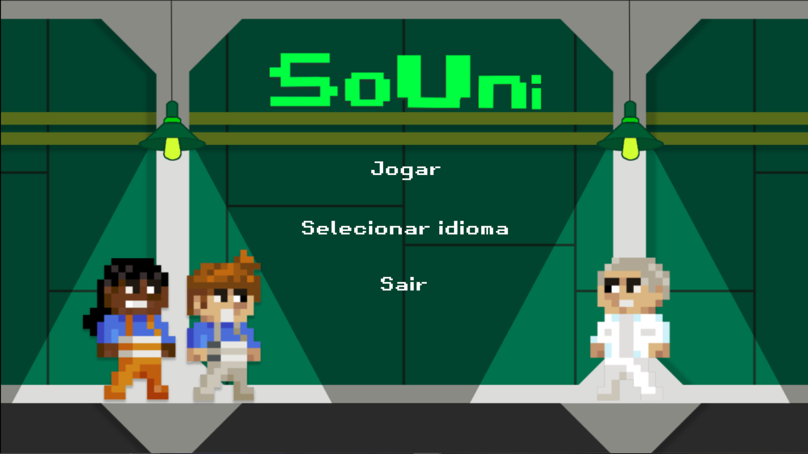
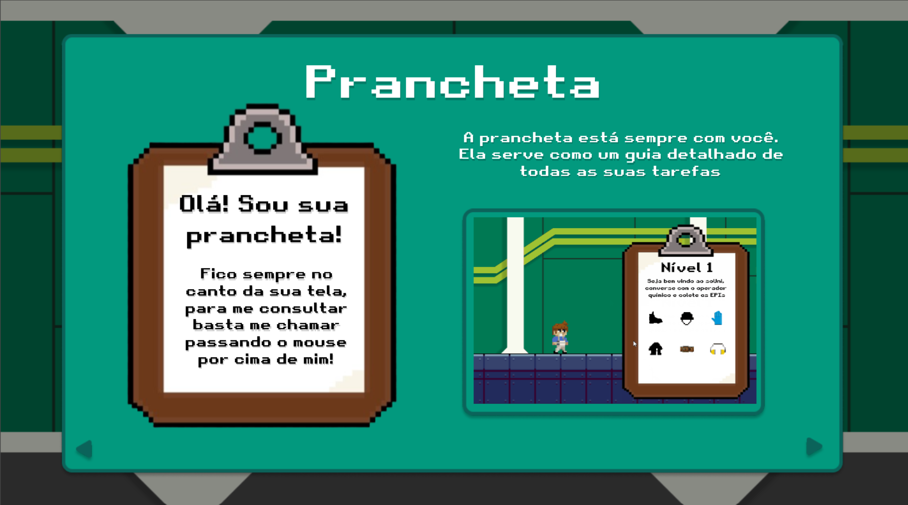
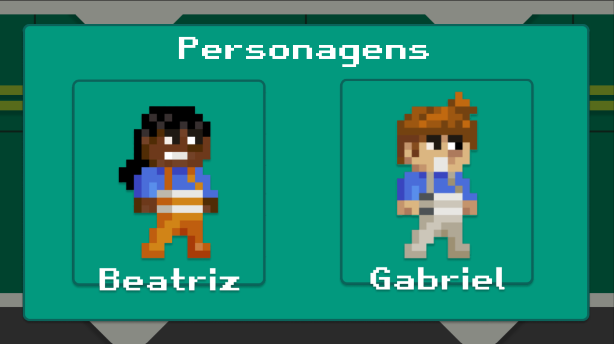
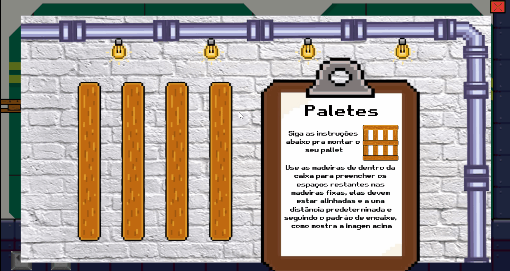
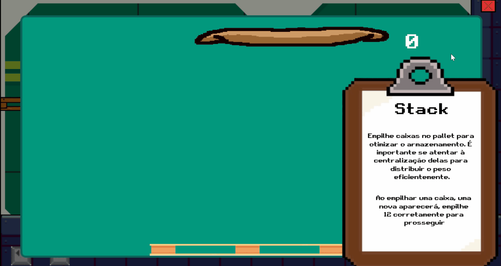

# Inteli - Instituto de Tecnologia e Liderança 

<p align="center">
<a href= "https://www.inteli.edu.br/"></a>
</p>

# Unipixel

## Integrantes:
- [Anna Aragão](https://www.linkedin.com/in/ann-aragao/)
- [Bruna Brasil](https://www.linkedin.com/in/bruna-brasil-alexandre-734055214/)
- [Eduardo Barreto](https://www.linkedin.com/in/eduardosbarreto/)
- [Gabriel de Macedo Santos](https://www.linkedin.com/in/gabriel-demacedosantos/)
- [Hugo Noyma](https://www.linkedin.com/in/hugo-noyma-19737b238/)
- [Raissa Moraes](https://www.linkedin.com/in/raissa-moraes-a89179264/)
- [Vitto Mazeto](https://www.linkedin.com/in/vitto-mazeto-b62592203/)

## Descrição

📜 Nosso projeto consiste em um jogo de plataforma 2D, com minigames e quizzes visando conscientizar e reforçar as regras e condutas para os operadores, com o objetivo de diminuir significantemente os acidentes dentro da [Unipar](https://www.unipar.com/). Assim, de forma divertida, os trabalhadores podem usar o seu intervalo na empresa para revisar os procedimentos e ganhar bonificações com o jogo. 

<p align="center">


</p>


💡   O soUni é um jogo 2D, feito na engine Godot, que visa revisar as regras para os operadores químicos dentro da indústria da Unipar, tanto em unidades nacionais quanto internacionais. Dessa forma, ele foi pensado e dividido em 3 modalidades: os níveis de plataforma, os minigames e o quiz final. A proposta de cada etapa busca reforçar o conhecimento de maneiras diferentes, a coleta de EPI's na fase inicial, demonstra que o operador deve estar sempre com os equipamentos corretos para então trabalhar dentro do setor químico.

<p align="center">


</p>

💡   Ademais, há os minigames, que exemplificam e ensinam praticas de segurança e execução de protocolos, com curiosidades sobre o material trabalhado. Então, após passar por níveis de PVC, Cloro e Soda, que são os principais produtos da Unipar, o jogador chega ao quiz final, em que haverão perguntas relacionadas a todo o processo que ele vivenciou no jogo, com um sistema de ranking que mostra sua colocação final.

<p align="center">


</p>

## 🛠 Estrutura de pastas

```
📂Raiz
  └ 📂docs
  └ 📂documentos
      └ 📂antigos
      └ 📄GDD.docx ou Documentação.docx
  └ 📂executáveis
      └ 📂windows
      └ 📂android
      └ 📂HTML
  └ 📂imagens
  └ 📂src
  └ 📄readme.md
```

## 🛠 Instalação

--Android:--

Por enquanto não há a versão android, mas é possível jogar o jogo mobile através do GitHub Pages

--Windows:--

Não há instalação! Apenas executável!
Encontre o JOGO.exe na pasta executáveis e execute-o como qualquer outro programa.

--HTML:--

Não há instalação!
Encontre o index.html na pasta executáveis e execute-o como uma página WEB (através de algum browser).

## 💻 Configuração para Desenvolvimento

1 - Clone o repositório. 

2 - Abra a engine de desenvolvimento (godot).

3 - No gerenciador de projetos inicial, clique no botão "importar" e, em seguida, no botão "navegar".

4 - Navegue até o repositório clonado e abra a pasta "src".

5 - Selecione o arquivo "project.godot" e em seguida clique no botão "abrir".

6 - Pronto. O seu ambiente de desenvolvimento está configurado.

Para abrir este projeto você necessita das seguintes ferramentas:

- [GODOT](https://godotengine.org/download)

## 🗃 Histórico de lançamentos

A cada atualização os detalhes devem ser lançados aqui.

- 5.0 - 06/04/2023
    - Tutorial interativo
    - Interação com o E no elevador
    - Level 3 de ácido 
    - Estacionamento da empilhadeira
    - Score do quiz
    - Questões do quiz
    - Minigame do quiz
    - Número total de valvulas foi setado
    - Configuração no menu
    - Tela cheia no jogo
    - Volume do jogo é variável
    - Cena de configuração
- 4.0 - 24/03/2023
    - Padronização de Assets 
    - Deploy no GithubPages
    - Correção no collision shape do personagem
    - PopUp do E ao passar pelo químico
    - Fechar o Minigame com o botão X
    - Minigame do PH
    - Adição do Nível 3
    - Correção no minigame do stack de 10 para 12 sacarias
    - Adição do sprite de sacarias no minigame do stack
    - Termo de responsabilidade de EPIs
    - Correção da musica travando
    - Biggame da válvula
    - Efeito sonoro na válvula
- 3.0 - 10/03/2023
    - Efeitos sonóros de diálogo e pulo
    - Músicas no Menu e nível
    - Efeito de Fadein e Fadeout
    - Adicionamos a personagem Beatriz
    - Fizemos a animação da Beatriz
    - Tradução dos Minigames 
    - Minigame do Labirinto
    - Renomeação das pastas para padronização
    - Cenas de tutorial
    - Cenas de seleção do personagem
    - Prancheta fica na tela até o jogador passar o cursor
    - Plataformas que caem (Pallets)
    - Stroke no Pallet
    - Mecânica de Subir na corda 
    - Mecância das válvulas no nível2
    - Adição do Nível 2
- 2.0 - 24/02/2023
    - Normalização do tamanho dos EPIs
    - Tela Principal
    - Menu
    - Botão de Mudança de Idioma 
    - Adição de Espanhol e Inglês
    - Minigame dos Pallets 
    - Minigame do Stack
    - Novo background e novo player
    - Touchscreen Buttons 
    - Efeito parallax
    - Prancheta
    - Textos da Prancheta
    - Json em HTML export
    - Telas de vitória e derrota no stack e pallet
    - Minigame Launcher
    - Prancheta nos Minigames
    - Restart do Diálogo
- 1.0 - 10/02/2023
    - Movimentação do Personagem
    - Coleta de EPIs
    - Primeiro Diálogo
    - Adição do Químico (NPC)

## 📋 Licença/License

<p xmlns:cc="http://creativecommons.org/ns#" xmlns:dct="http://purl.org/dc/terms/"><a property="dct:title" rel="cc:attributionURL" href="https://github.com/Spidus/Teste_Final_1">MODELO GIT INTELI</a> by <a rel="cc:attributionURL dct:creator" property="cc:attributionName" href="https://www.yggbrasil.com.br/vr">INTELI, VICTOR BRUNO ALEXANDER ROSETTI DE QUIROZ</a> is licensed under <a href="http://creativecommons.org/licenses/by/4.0/?ref=chooser-v1" target="_blank" rel="license noopener noreferrer" style="display:inline-block;">Attribution 4.0 International</a></p>

## 🎓 Referências

1. Músicas por: [HeatleyBros](https://heatleybros.com/)
2. Projeto de inspiração: [MY roadlab (Jogo desenvolvido por alunos do Inteli)](https://github.com/2022M1T4-Inteli/My-roadlab)
3. Documentação: [Classes em Godot](https://docs.godotengine.org/pt_BR/latest/tutorials/best_practices/what_are_godot_classes.html?)
4. Site: [Unipar](unipar.com)
5. Processo Produtivo : [Unipar](https://www.unipar.com/processo-produtivo/)
6. Relatório de Sustentabilidade: [Unipar](https://www.unipar.com/relatorio-de-sustentabilidade/)
7. Documentação: [Godot](https://docs.godotengine.org/en/stable/tutorials/2d/index.html)